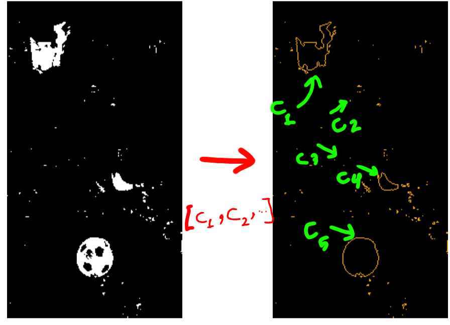
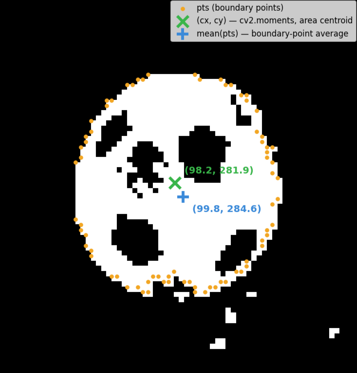
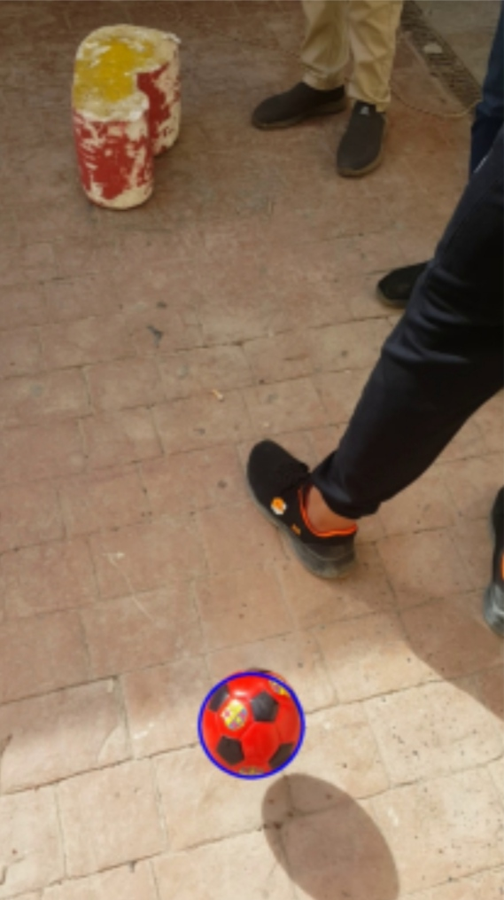

# How does it detects

1- We turn the image into HSV

2- Splits the image into 2 channels (red and blue) using different mask for each color

### important kernels for each channel

- a 3x3 kernel for the red channel to remove noise around the shapes, this prevent it from detecting small points as circles
0 | 1 | 0
--- | --- | ---
1 | 1 | 1
0 | 1 | 0


- a 5x5 kernel for the blue channel to fill up holes inside of shape so it would help out with the detection and reduce false positive

0 | 0 | 1 | 0 | 0
--- | --- | --- | --- | ---
0 | 1 | 1 | 1 | 0
1 | 1 | 1 | 1 | 1
0 | 1 | 1 | 1 | 0
0 | 0 | 1 | 0 | 0


### functions


### **1 - extract_ball** :

it first measures all of the pixels on the filtered image so we can use it later
```python
total_pixels = cv2.countNonZero(mask)
```

 Then it splits the image into different objects based on connection
```python
contours, _ = cv2.findContours(mask, cv2.RETR_EXTERNAL, cv2.CHAIN_APPROX_SIMPLE)
```



Then it loops through all the objects and check
If there is no pixel (there is nothing detected) then it skips
If the area detected for the object is smaller than a percentage of the total pixel then it is likely just noise, so it skips it

```python
if total_pixels == 0 or area < area_fraction * total_pixels :
    continue
```

Then it calculates the center of the object by using the moment of inertia
Then it calculates the edges for the shape as (x,y) then it gets the mean of all of the points and make that the predicted center
Then it calculates the difference between the two centers
The (roundness) variable gives it a percentage of how close is it to a circle (1 being a circle, 0 being not a circle)
Then it do that for every object until it find the best roundness object

```python
M = cv2.moments(c)
cx, cy = M['m10']/M['m00'], M['m01']/M['m00']
pts = c.reshape(-1, 2)
dists = np.sqrt((pts[:,0]-cx)**2 + (pts[:,1]-cy)**2)
roundness = 1 - (np.std(dists) / np.mean(dists))
```




We create a mask the same size as the original picture and we draw only the best object that looks like the ball

```python
ball_mask = np.zeros_like(mask)
cv2.drawContours(ball_mask, [best_contour], -1, 255, thickness=cv2.FILLED)
ball_only = cv2.bitwise_and(resized, resized, mask=ball_mask)
```

At the end we return the ball image and the gray version of it for future detection

```python
ball_gray = cv2.cvtColor(ball_only, cv2.COLOR_BGR2GRAY)
return ball_only, ball_gray
```

- we do all of that for both channels


### **2- detect_circle** :

We blue the black and white image to make sure we have filled circles and also another way for removing small pixels attached to the circle
Then we detect using Hough from openCV

```python
blurred = cv2.GaussianBlur(ball_gray, (9, 9), 25)

circles = cv2.HoughCircles(
blurred,
cv2.HOUGH_GRADIENT, 
dp=1,
minDist=20,
param1=param1, 
param2=20, 
minRadius=min , 
maxRadius=10000)
```

param1 is adjusted for each channel based on trial and error

```python
if label == "Red Ball":
    param1 = 20

elif label == "Blue Ball":
    param1 = 35  
```

We save the coordinates and the radius of the circle and we return them after we draw the circles 

```python
circles = np.round(circles[0, :]).astype(int)
x, y, r = circles[0]  # or pick the best among multiple by some criterion

cv2.circle(resized, (x, y), r, color, 5)
print(f"{label}: center=({x},{y}) r={r}, {len(circles)} circle(s) detected")

    return (x, y, r)
```





### **3- bbox_to_yolo / write_label_file** :

Once we have the ball's contour from extract_ball(), we also grab its bounding box with cv2.boundingRect. This gives us (x, y, w, h)

the top-left corner plus width and height of the box around the ball.
```python
bbox = cv2.boundingRect(best_contour)  # (x, y, w, h)
```
YOLO format doesn't use pixel coordinates directly, it wants everything normalized between 0 and 1, and it wants the *center* of the box instead of the corner. So bbox_to_yolo converts our (x, y, w, h) into (x_center, y_center, width, height), all divided by the image's width/height:
```python
x_center = (x + w / 2) / img_w
y_center = (y + h / 2) / img_h
norm_w = w / img_w
norm_h = h / img_h
```
Then for each image, we build a list of labels — one entry per ball detected, with a class id (`1` for red, `0` for blue) followed by the 4 normalized values:
```python
labels.append((1, x_c, y_c, bw, bh))  # red
labels.append((0, x_c, y_c, bw, bh))  # blue
```
write_label_file just writes each one out as a line of text, space-separated, rounded to 6 decimal places — this is the exact format YOLO expects:
```python
f.write(f"{class_id} {x_c:.2f} {y_c:.2f} {w:.2f} {h:.2f}\n")
```
### **4- process_folder** :

This function processes a whole folder of images instead of one. It loops through every jpg, runs get_masks then extract_ball to get the red and blue bounding boxes, converts them with bbox_to_yolo, and collects them into labels.

The output file is named after the image, swapping the extension for txt — so ball_3.jpg becomes ball_3.txt, matching YOLO's expected naming.
```python
base_name = os.path.splitext(os.path.basename(image_path))[0]
output_path = os.path.join(output_dir, base_name + ".txt")
```
If no ball is found, it's just left out of labels, so the txt file may have 0, 1, or 2 lines.


### **5- Handling the size-mismatch vulnerability** :

While testing on the full image set, I noticed a vulnerability: some images have a small red or blue speck close to the real ball, and since it passes the same color/area filtering, extract_ball would sometimes pick it up as a second detection instead of noise. This mostly happened when the real ball and the noise blob were close together but had very different sizes.


To catch this, we compare the radius of the two detected circles from detect_circle. If one ball's radius is less than half the other's, it's treated as noise and dropped before it becomes a label:
```python
red_r = red_circle[2] if red_circle is not None else None
blue_r = blue_circle[2] if blue_circle is not None else None

if red_r is not None and blue_r is not None:
    if red_r < blue_r / 2:
        red_bbox = None
    elif blue_r < red_r / 2:
        blue_bbox = None
```

This way, a ball flagged as noise never gets drawn or printed either — it's dropped consistently everywhere.
