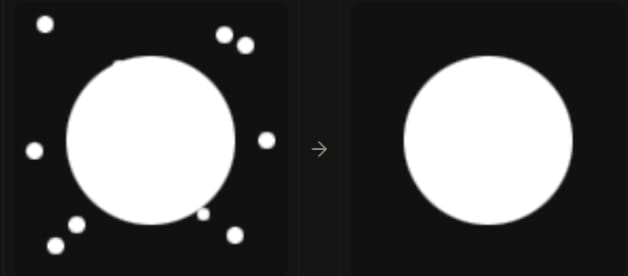
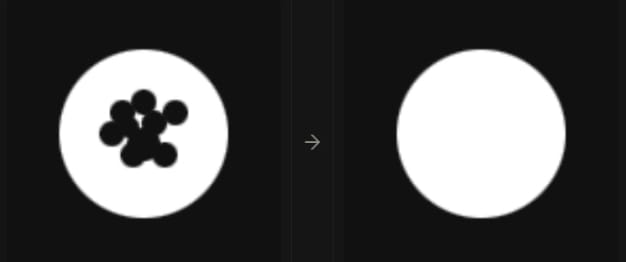

# How does it detects

1- We turn the image into HSV

2- Splits the image into 2 channels (red and blue) using different mask for each color

### important kernels for each channel

- a 3x3 kernel for the red channel to remove noise around the shapes, this prevent it from detecting small points as circles
0 | 1 | 0
--- | --- | ---
1 | 1 | 1
0 | 1 | 0



- a 5x5 kernel for the blue channel to fill up holes inside of shape so it would help out with the detection and reduce false positive

0 | 0 | 1 | 0 | 0
--- | --- | --- | --- | ---
0 | 1 | 1 | 1 | 0
1 | 1 | 1 | 1 | 1
0 | 1 | 1 | 1 | 0
0 | 0 | 1 | 0 | 0




### functions


**1 - extract_ball** :

it first measures all of the pixels on the filtered image so we can use it later
```python
total_pixels = cv2.countNonZero(mask)
```

 Then it splits the image into different objects based on connection
```python
contours, _ = cv2.findContours(mask, cv2.RETR_EXTERNAL, cv2.CHAIN_APPROX_SIMPLE)
```


Then it loops through all the objects and check
If there is no pixel (there is nothing detected) then it skips
If the area detected for the object is smaller than a percentage of the total pixel then it is likely just noise, so it skips it

```python
if total_pixels == 0 or area < area_fraction * total_pixels :
    continue
```

Then it calculates the center of the object by using the moment of inertia
Then it calculates the edges for the shape as (x,y) then it gets the mean of all of the points and make that the predicted center
Then it calculates the difference between the two centers
The (roundness) variable gives it a percentage of how close is it to a circle (1 being a circle, 0 being not a circle)
Then it do that for every object until it find the best roundness object

```python
M = cv2.moments(c)
cx, cy = M['m10']/M['m00'], M['m01']/M['m00']
pts = c.reshape(-1, 2)
dists = np.sqrt((pts[:,0]-cx)**2 + (pts[:,1]-cy)**2)
roundness = 1 - (np.std(dists) / np.mean(dists))
```


We create a mask the same size as the original picture and we draw only the best object that looks like the ball

```python
ball_mask = np.zeros_like(mask)
cv2.drawContours(ball_mask, [best_contour], -1, 255, thickness=cv2.FILLED)
ball_only = cv2.bitwise_and(resized, resized, mask=ball_mask)
```

At the end we return the ball image and the gray version of it for future detection

```python
ball_gray = cv2.cvtColor(ball_only, cv2.COLOR_BGR2GRAY)
return ball_only, ball_gray
```

- we do all of that for both channels


**2- detect_circle** :

We blue the black and white image to make sure we have filled circles and also another way for removing small pixels attached to the circle
Then we detect using Hough from openCV

```python
blurred = cv2.GaussianBlur(ball_gray, (9, 9), 25)

circles = cv2.HoughCircles(
blurred,
cv2.HOUGH_GRADIENT, 
dp=1,
minDist=20,
param1=param1, 
param2=20, 
minRadius=min , 
maxRadius=10000)
```

param1 is adjusted for each channel based on trial and error

```python
if label == "Red Ball":
    param1 = 20

elif label == "Blue Ball":
    param1 = 35  
```

We save the coordinates and the radius of the circle and we return them after we draw the circles 

```python
circles = np.round(circles[0, :]).astype(int)
x, y, r = circles[0]  # or pick the best among multiple by some criterion

cv2.circle(resized, (x, y), r, color, 5)
print(f"{label}: center=({x},{y}) r={r}, {len(circles)} circle(s) detected")

    return (x, y, r)
```


