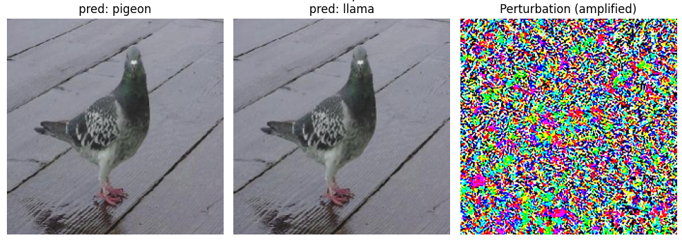
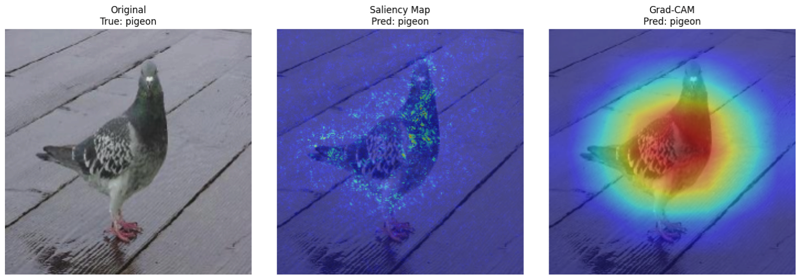
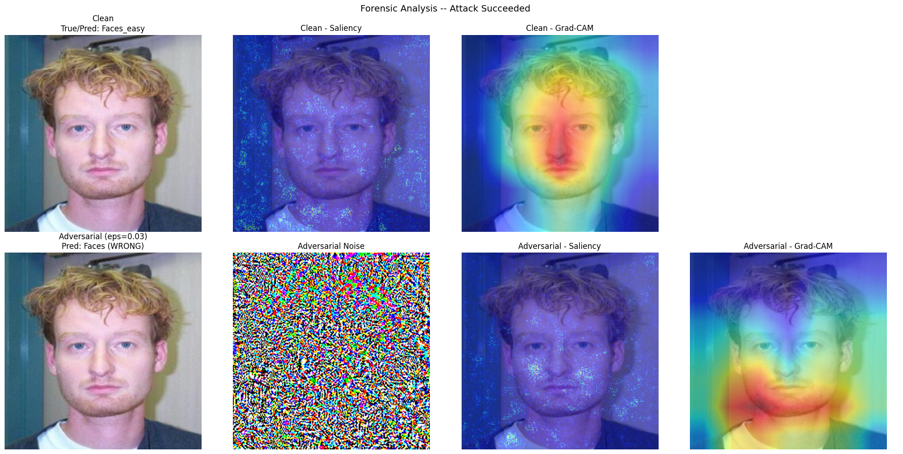

# CNN using ResNet34 and MobileNet_V2

# Phase 1

we have two models (ResNet34, MobileNet_V2) and the Caltech101 dataset


we frozen all the layers layers in both models except the last convolutional layer

```python
#ResNet34
for p in model.parameters():
    p.requires_grad = False
for p in model.layer4.parameters():          # last conv block
    p.requires_grad = True
    
###############################################

#MobileNet_V2
for p in model.parameters():
    p.requires_grad = False
for p in model.features[-1].parameters():    # last conv block
    p.requires_grad = True
```


then we set the number of outputs of the last fully connected layer with the number classes from the dataset


```python
#ResNet34
model.fc = nn.Linear(model.fc.in_features, num_classes)


#MobileNet_V2
model.classifier[-1] = nn.Linear(model.classifier[-1].in_features, num_classes)
```


this function trains the model for a set number of epochs, evaluating on a validation set after each epoch and stepping a cosine-annealed learning rate schedule, which lower the learning rate over time. we save every train/val loss and accuracy in a history dict, and keeps a checkpoint of the weights from the best-performing epoch (by validation accuracy).


```python
def train_model(model, train_loader, val_loader, epochs=8, lr=1e-3, weight_decay=1e-4):
    
    criterion = nn.CrossEntropyLoss()
    trainable_params = filter(lambda p: p.requires_grad, model.parameters())
    optimizer = optim.Adam(trainable_params, lr=lr, weight_decay=weight_decay)
    scheduler = optim.lr_scheduler.CosineAnnealingLR(optimizer, T_max=epochs)

    history = {"train_loss": [], "train_acc": [], "val_loss": [], "val_acc": []}
    best_val_acc = 0.0
    best_state = copy.deepcopy(model.state_dict())

    for epoch in range(epochs):
        model.train()
        running_loss, correct, total = 0.0, 0, 0
        for images, labels in tqdm(train_loader, desc=f"Epoch {epoch+1}/{epochs} [train]"):
            images, labels = images.to(device), labels.to(device)

            optimizer.zero_grad()
            outputs = model(images)
            loss = criterion(outputs, labels)
            loss.backward()
            optimizer.step()

            running_loss += loss.item() * images.size(0)
            correct += (outputs.argmax(1) == labels).sum().item()
            total += labels.size(0)

        train_loss, train_acc = running_loss / total, correct / total

        model.eval()
        val_loss, val_correct, val_total = 0.0, 0, 0
        with torch.no_grad():
            for images, labels in tqdm(val_loader, desc=f"Epoch {epoch+1}/{epochs} [val]"):
                images, labels = images.to(device), labels.to(device)
                outputs = model(images)
                loss = criterion(outputs, labels)
                val_loss += loss.item() * images.size(0)
                val_correct += (outputs.argmax(1) == labels).sum().item()
                val_total += labels.size(0)

        val_loss, val_acc = val_loss / val_total, val_correct / val_total
        scheduler.step()

        history["train_loss"].append(train_loss); history["train_acc"].append(train_acc)
        history["val_loss"].append(val_loss);     history["val_acc"].append(val_acc)

        print(f"Epoch [{epoch+1}/{epochs}] "
              f"train_loss={train_loss:.4f} train_acc={train_acc:.3f} | "
              f"val_loss={val_loss:.4f} val_acc={val_acc:.3f}")

        if val_acc > best_val_acc:
            best_val_acc = val_acc
            best_state = copy.deepcopy(model.state_dict())

    model.load_state_dict(best_state)
    print(f"Best val accuracy: {best_val_acc:.3f}")
    return model, history
```

# Phase 2 (Adversarial Attack)

### FGSM :

This method computes the gradient of the loss with respect to every pixel in the image  telling us, for each pixel, which direction (increase or decrease) would make the model's loss go up. It then builds a "noise" image using only the sign of each pixel's gradient (+1 or -1), scaled by a small epsilon. Adding this noise to the original image nudges every pixel slightly in the direction that increases the loss, meaning the model becomes more wrong.

```python
def fgsm_attack(model, images, labels, epsilon):
    images = images.clone().detach().to(device)
    labels = labels.clone().detach().to(device)
    images.requires_grad_(True)

    outputs = model(images)
    loss = F.cross_entropy(outputs, labels)

    model.zero_grad()
    loss.backward()

    perturbation = epsilon * images.grad.data.sign()
    perturbed = images + perturbation

    perturbed_pixels = denormalize(perturbed).clamp(0.0, 1.0)
    perturbed = normalize(perturbed_pixels)

    return perturbed.detach()
```


On the left is the original image. 

On the right is the perturbation, the noise generated from the image's gradients. 

In the middle is the original image + the perturbation. 

The original and adversarial images may look identical to the human eye, but to the model, they are different

the noise the rainbow color + black and white




# Phase 3: Model Explainability Implementation

Two XAI techniques get implemented: **Saliency Maps** and **Grad-CAM**. Both work on the same basic idea, but they look at completely different parts of the network to do it.

### 1 - compute_saliency (Vanilla Gradients)

It forward passes the image, picks the score for the target class, then backward passes from that score instead of from a loss. This gives the gradient of the class score with respect to every input pixel telling how much each pixel would push the prediction up or down.

It takes the absolute value without the sign and takes the max across the 3 color channels so it ends up with one importance value per pixel instead of 3. Then it gets normalized to [0,1] so it can be drawn as a heatmap.

```python
def compute_saliency(model, image, target_class=None):
    model.eval()
    image = image.clone().detach().to(device)
    if image.dim() == 3:
        image = image.unsqueeze(0)
    image.requires_grad_(True)

    output = model(image)
    if target_class is None:
        target_class = output.argmax(1).item()

    score = output[0, target_class]
    model.zero_grad()
    score.backward()

    saliency = image.grad.data.abs().squeeze(0)      # (C, H, W)
    saliency, _ = saliency.max(dim=0)                 # (H, W) -- max across color channels
    saliency = saliency.cpu().numpy()
    saliency = (saliency - saliency.min()) / (saliency.max() - saliency.min() + 1e-8)
    return saliency, target_class
```

### 2 - GradCAM class

It looks at the **last convolutional layer's** activation maps instead, and figures out which channels of that layer mattered most for the target class.

To get access to a layer's activations and gradients mid-forward/backward-pass (without modifying the model itself), two hooks get registered on the target layer:

- **One during the forward pass** — the moment the target layer produces its output, this hook grabs a copy and stores it.
- **One during the backward pass** — the moment gradients flow backward *through* that same layer, this hook grabs a copy of that gradient and stores it too.

```python
class GradCAM:
    def __init__(self, model, target_layer):
        self.model = model
        self.activations = None
        self.gradients = None
        self._fwd_handle = target_layer.register_forward_hook(self._save_activation)
        self._bwd_handle = target_layer.register_full_backward_hook(self._save_gradient)

    def _save_activation(self, module, input, output):
        self.activations = output.detach()

    def _save_gradient(self, module, grad_input, grad_output):
        self.gradients = grad_output[0].detach()

    def __call__(self, image, target_class=None):
        self.model.eval()
        image = image.clone().detach().to(device)
        if image.dim() == 3:
            image = image.unsqueeze(0)
        image.requires_grad_(True)

        output = self.model(image)
        if target_class is None:
            target_class = output.argmax(1).item()

        score = output[0, target_class]
        self.model.zero_grad()
        score.backward()

        weights = self.gradients.mean(dim=(2, 3), keepdim=True)               # channel importance
        cam = F.relu((weights * self.activations).sum(dim=1, keepdim=True))
        cam = cam.squeeze().cpu().numpy()
        cam = cv2.resize(cam, (image.shape[-1], image.shape[-2]))
        cam = (cam - cam.min()) / (cam.max() - cam.min() + 1e-8)
        return cam, target_class

    def remove(self):
        self._fwd_handle.remove()
        self._bwd_handle.remove()
```

Once the target class's score is obtained, a backward pass is performed to compute gradients with respect to the last convolutional layer's feature maps.

- Each channel's gradient is averaged across its own spatial map (global average pooling), producing a single **importance weight** per channel.
- Each channel's activation map is multiplied by its corresponding importance weight, and the weighted channels are summed together into a single combined map.
- A ReLU is applied to this combined map, so only pixels that push *towards* the target class are retained—pixels that push away from it are discarded.
- Since this map is produced at the small spatial resolution of the last convolutional layer, it is resized back up to the input image's dimensions and normalized to produce the final output.

### 3 - overlay_heatmap / explain (unified pipeline)

`overlay_heatmap` just blends a heatmap onto the real image using a colormap (blue = low importance, red = high) with some transparency, so it's actually readable.

`explain` is a small switchboard function on top of everything above give it a model, an image, and a method name (`"saliency"` or `"gradcam"`), and it calls the right function, overlays the result, and hands back the raw map, the overlay, and the predicted class. This is what every later phase calls instead of touching `compute_saliency`/`GradCAM` directly.

```python
def overlay_heatmap(image_tensor, heatmap, alpha=0.5):
    img = denormalize(image_tensor.unsqueeze(0)).squeeze(0).permute(1, 2, 0).cpu().numpy()
    img = np.clip(img, 0, 1)
    heatmap_rgb = plt.cm.jet(heatmap)[..., :3]
    overlay = (1 - alpha) * img + alpha * heatmap_rgb
    return np.clip(overlay, 0, 1)


def explain(model, image, method, target_class=None, gradcam_extractor=None):
    if method == "saliency":
        raw_map, pred_class = compute_saliency(model, image, target_class)
    elif method == "gradcam":
        if gradcam_extractor is None:
            raise ValueError("gradcam_extractor is required for method='gradcam'")
        raw_map, pred_class = gradcam_extractor(image, target_class)
    else:
        raise ValueError(f"Unknown method: {method}")

    overlay = overlay_heatmap(image, raw_map)
    return raw_map, overlay, pred_class
```

One `GradCAM` extractor gets built per model up front (`resnet_gradcam`, `mobilenet_gradcam`) and reused everywhere, since it's just wrapping hooks around a fixed layer no need to rebuild it per call.

On the left is the original image, with its true class as the title.

In the middle is the saliency overlay the per-pixel gradient heatmap from `compute_saliency`, blended onto the image. Red/warm areas are pixels the model's prediction is most sensitive to.

On the right is the Grad-CAM overlay same idea, but based on the last convolutional layer's activations instead of raw pixels, so it tends to highlight broader regions/shapes rather than individual pixels.

Both maps should roughly agree on where the model is "looking," since they're explaining the same clean prediction this is the baseline to compare against once adversarial attacks get involved in Phase 4.



---

# Phase 4: Forensic Analysis

- **Clean pass**: Gets the model's prediction on the original image, plus Saliency and Grad-CAM explanations showing what it normally focuses on.
- **Attack**: Runs an FGSM attack (strength controlled by `epsilon`) to generate an adversarial image, then gets the model's new (likely wrong) prediction on it.
- **Noise extraction**: Computes the actual pixel difference between clean and adversarial images, normalized for visualization.
- **Adversarial explanations**: Regenerates Saliency and Grad-CAM, this time targeting the adversarial prediction, to reveal *where* the model's attention shifted after the attack.
- **Output**: Returns a summary dict — `true_label`, `clean_pred`, `adv_pred`, `attack_success` (bool), and `epsilon` — capturing whether and how the attack fooled the model.

```python
def forensic_analysis(model, gradcam_extractor, image, true_label, class_names, epsilon=0.03):
    image = image.to(device)
    label_t = torch.tensor([true_label]).to(device)

    #1. Clean
    with torch.no_grad():
        clean_pred = model(image.unsqueeze(0)).argmax(1).item()
    _, clean_saliency_overlay, _ = explain(model, image, "saliency")
    _, clean_gradcam_overlay, _  = explain(model, image, "gradcam", gradcam_extractor=gradcam_extractor)

    #2. Attack
    adv_image = fgsm_attack(model, image.unsqueeze(0), label_t, epsilon).squeeze(0)
    with torch.no_grad():
        adv_pred = model(adv_image.unsqueeze(0)).argmax(1).item()

    noise = (denormalize(adv_image.unsqueeze(0)) - denormalize(image.unsqueeze(0))).squeeze(0)
    noise_vis = (noise - noise.min()) / (noise.max() - noise.min() + 1e-8)
    noise_vis = noise_vis.permute(1, 2, 0).cpu().numpy()

    #3. XAI
    _, adv_saliency_overlay, _ = explain(model, adv_image, "saliency", target_class=adv_pred)
    _, adv_gradcam_overlay, _  = explain(model, adv_image, "gradcam", target_class=adv_pred,
                                          gradcam_extractor=gradcam_extractor)
```

The function also plots a 2x4 grid (clean image / clean saliency / clean Grad-CAM / blank, then adversarial image / noise / adversarial saliency / adversarial Grad-CAM) and returns a small dict summarizing the outcome, so it can get looped over several images and dumped into a table:

```python
set_seed(1)
forensic_sample_indices = random.sample(range(len(test_dataset)), 5)

forensic_results = []
for idx in forensic_sample_indices:
    image, true_label = test_dataset[idx]
    result = forensic_analysis(resnet_model, resnet_gradcam, image, true_label, CLASS_NAMES, epsilon=0.03)
    forensic_results.append(result)

forensic_df = pd.DataFrame(forensic_results)
```

Each picture below is one full forensic grid, laid out in 2 rows of 4 panels. 

Top row, left to right: the clean image with its true/predicted class, the clean saliency overlay, the clean Grad-CAM overlay, and a blank panel. 

Bottom row: the adversarial image with its new (wrong) prediction, the amplified adversarial noise on its own, the adversarial saliency overlay, and the adversarial Grad-CAM overlay both computed for the wrong predicted class, so they show what the model latched onto to get it wrong.




---

# Phase 5: The Countermeasure Protocol (Model Hardening)

**Defense chosen: Adversarial Training.** Each training batch gets an FGSM-attacked version generated, and the model is trained on both the clean and adversarial batches together. Since FGSM perturbs pixels in the exact direction the model's own gradient finds most damaging, this forces the model to stay correct even under its own worst-case input, making it more robust over time.

```python
def adversarial_train(model, train_loader, val_loader, epochs=5, lr=1e-4, epsilon=0.03):
    criterion = nn.CrossEntropyLoss()
    trainable_params = filter(lambda p: p.requires_grad, model.parameters())
    optimizer = optim.Adam(trainable_params, lr=lr)

    for epoch in range(epochs):
        model.train()
        running_loss, correct, total = 0.0, 0, 0

        for images, labels in tqdm(train_loader, desc=f"[Adversarial Training] Epoch {epoch+1}/{epochs}"):
            images, labels = images.to(device), labels.to(device)

            adv_images = fgsm_attack(model, images, labels, epsilon)

            combined_images = torch.cat([images, adv_images], dim=0)
            combined_labels = torch.cat([labels, labels], dim=0)

            optimizer.zero_grad()
            outputs = model(combined_images)
            loss = criterion(outputs, combined_labels)
            loss.backward()
            optimizer.step()
            ...
```

The batch doubles in size (clean + adversarial concatenated together) so the data has the clean and adversarial , so we remove the adversarial for the evaluation

`hardened_resnet` starts from the same already-trained Phase 1 weights this way the comparison isolates the effect of adversarial training itself, instead of mixing

```python
hardened_resnet, hardened_target_layer = build_model("resnet34")
hardened_resnet.load_state_dict(resnet_model.state_dict())

BEST_EPSILON = 0.03  # informed by the Phase 2 epsilon sweep

hardened_resnet = adversarial_train(hardened_resnet, train_loader, val_loader,
                                     epochs=5, lr=1e-4, epsilon=BEST_EPSILON)
hardened_gradcam = GradCAM(hardened_resnet, hardened_target_layer)
```

### The Showdown

Accuracy of the original and hardened model, on both the clean test set and an adversarially attacked version of it (`BEST_EPSILON = 0.03`, the reference strength from the Phase 2 sweep):

```python
showdown = {
    "Original - Clean":       evaluate_accuracy(resnet_model, test_loader, desc="Original/Clean"),
    "Original - Adversarial": evaluate_accuracy(resnet_model, test_loader, attack_fn=fgsm_attack,
                                                 epsilon=BEST_EPSILON, desc="Original/Adversarial"),
    "Hardened - Clean":       evaluate_accuracy(hardened_resnet, test_loader, desc="Hardened/Clean"),
    "Hardened - Adversarial": evaluate_accuracy(hardened_resnet, test_loader, attack_fn=fgsm_attack,
                                                 epsilon=BEST_EPSILON, desc="Hardened/Adversarial"),
}
```

**added:** same gap as Phase 4 the assignment wants architectures compared, and only ResNet-34 had gone through hardening. The same hardening run got added for MobileNetV2, starting from its own Phase 1 weights:

```python
hardened_mobilenet, hardened_mobilenet_target_layer = build_model("mobilenet_v2")
hardened_mobilenet.load_state_dict(mobilenet_model.state_dict())

hardened_mobilenet = adversarial_train(hardened_mobilenet, train_loader, val_loader,
                                        epochs=5, lr=1e-4, epsilon=BEST_EPSILON)
hardened_mobilenet_gradcam = GradCAM(hardened_mobilenet, hardened_mobilenet_target_layer)
```

and the showdown got extended into one combined 8-row table (both architectures x original/hardened x clean/adversarial), so the report can directly compare whether adversarial training helps one architecture more than the other:

```python
full_showdown = {
    "ResNet-34 - Original - Clean":         evaluate_accuracy(resnet_model, test_loader, ...),
    "ResNet-34 - Original - Adversarial":   evaluate_accuracy(resnet_model, test_loader, attack_fn=fgsm_attack, ...),
    "ResNet-34 - Hardened - Clean":         evaluate_accuracy(hardened_resnet, test_loader, ...),
    "ResNet-34 - Hardened - Adversarial":   evaluate_accuracy(hardened_resnet, test_loader, attack_fn=fgsm_attack, ...),
    "MobileNetV2 - Original - Clean":       evaluate_accuracy(mobilenet_model, test_loader, ...),
    "MobileNetV2 - Original - Adversarial": evaluate_accuracy(mobilenet_model, test_loader, attack_fn=fgsm_attack, ...),
    "MobileNetV2 - Hardened - Clean":       evaluate_accuracy(hardened_mobilenet, test_loader, ...),
    "MobileNetV2 - Hardened - Adversarial": evaluate_accuracy(hardened_mobilenet, test_loader, attack_fn=fgsm_attack, ...),
}
```

This table is the main quantitative proof for Phase 5 each row is one setting (architecture x original/hardened x clean/adversarial) and its resulting test accuracy. It belongs front and center in the report, since it's what actually proves the defense worked (or didn't, or worked unevenly across architectures).

### Bonus: does the hardened model focus on the correct features even under attack?

`forensic_analysis` gets re-run on the exact same `forensic_sample_indices` from Phase 4, but pointed at `hardened_resnet` / `hardened_gradcam` this is directly comparable to the original model's forensic output since it's the same images, same epsilon, just a different (hardened) model.

```python
hardened_forensic_results = []
for idx in forensic_sample_indices:
    image, true_label = test_dataset[idx]
    result = forensic_analysis(hardened_resnet, hardened_gradcam, image, true_label, CLASS_NAMES,
                                epsilon=BEST_EPSILON)
    hardened_forensic_results.append(result)
```

Two forensic grids side by side, same layout as Phase 4's (clean image/saliency/Grad-CAM on top, adversarial image/noise/saliency/Grad-CAM on bottom) one for the *original* model, one for the *hardened* model, same image, same attack strength. The image chosen for this comparison should ideally be one that fooled the original model but not the hardened one, so the pair visibly shows the prediction flipping back to correct and the adversarial saliency/Grad-CAM panels shifting to focus on more sensible regions of the image once hardened.

A second version of the same pairing for MobileNetV2 (original vs hardened) is optional, but backs up the full 8-row table with an actual visual instead of just numbers.


| Setting                              | Accuracy |
| ------------------------------------ | -------- |
| ResNet-34 - Original - Clean         | 0.946278 |
| ResNet-34 - Original - Adversarial   | 0.214889 |
| ResNet-34 - Hardened - Clean         | 0.945510 |
| ResNet-34 - Hardened - Adversarial   | 0.447429 |
| MobileNetV2 - Original - Clean       | 0.937068 |
| MobileNetV2 - Original - Adversarial | 0.088258 |
| MobileNetV2 - Hardened - Clean       | 0.934766 |
| MobileNetV2 - Hardened - Adversarial | 0.162701 |

---

### New: Improving the Model (PGD-Based Hardening)

The original Phase 5 defense used **FGSM** to generate adversarial examples during training. While this measurably improved robustness, the gain was uneven across architectures

To address this, the defense was upgraded to use **PGD (Projected Gradient Descent)** instead of FGSM as the training-time attack.

#### PGD Attack

PGD is a stronger, multi-step version of FGSM: rather than taking one gradient step of size `epsilon`, it takes several smaller steps of size `alpha`, re-clipping ("projecting") the result back into the allowed `epsilon`-ball around the original image after every step. Training against PGD is a stricter requirement than training against FGSM, since FGSM is mathematically a special case of PGD with a single step — a model that resists PGD resists FGSM as a consequence.

```python
def pgd_attack(model, images, labels, epsilon, alpha=None, num_steps=7, random_start=True):
    if alpha is None:
        alpha = epsilon / 4

    images = images.clone().detach().to(device)
    labels = labels.clone().detach().to(device)
    clean_pixels = denormalize(images).clamp(0.0, 1.0).detach()

    if random_start:
        perturbed_pixels = clean_pixels + torch.empty_like(clean_pixels).uniform_(-epsilon, epsilon)
        perturbed_pixels = perturbed_pixels.clamp(0.0, 1.0).detach()
    else:
        perturbed_pixels = clean_pixels.clone().detach()

    for _ in range(num_steps):
        perturbed_pixels.requires_grad_(True)
        outputs = model(normalize(perturbed_pixels))
        loss = F.cross_entropy(outputs, labels)

        model.zero_grad()
        grad = torch.autograd.grad(loss, perturbed_pixels)[0]

        with torch.no_grad():
            perturbed_pixels = perturbed_pixels + alpha * grad.sign()
            delta = torch.clamp(perturbed_pixels - clean_pixels, min=-epsilon, max=epsilon)
            perturbed_pixels = (clean_pixels + delta).clamp(0.0, 1.0)

    return normalize(perturbed_pixels).detach()
```

#### PGD-Based Adversarial Training

`adversarial_train_pgd` follows the same batch-doubling structure as the original `adversarial_train` (clean + adversarial batches concatenated, trained together), with three additions aimed at improving robust generalization:

- **Weight decay** and **light label smoothing** — mild regularization that discourages the overconfident predictions adversarial perturbations tend to exploit.
- **Cosine learning-rate schedule** — same scheduling approach used in Phase 1's `train_model`.
- **Best-checkpoint selection by clean validation accuracy** — since adversarial training can overfit to the adversarial half of the batch in later epochs, the model state with the highest clean validation accuracy is kept rather than simply the final epoch's weights.

```python
def adversarial_train_pgd(model, train_loader, val_loader, epochs=8, lr=1e-4,
                           epsilon=0.03, pgd_steps=7, weight_decay=1e-4):
    criterion = nn.CrossEntropyLoss(label_smoothing=0.05)
    trainable_params = filter(lambda p: p.requires_grad, model.parameters())
    optimizer = optim.Adam(trainable_params, lr=lr, weight_decay=weight_decay)
    scheduler = optim.lr_scheduler.CosineAnnealingLR(optimizer, T_max=epochs)

    best_val_acc = 0.0
    best_state = copy.deepcopy(model.state_dict())

    for epoch in range(epochs):
        model.train()
        running_loss, correct, total = 0.0, 0, 0

        for images, labels in tqdm(train_loader, desc=f"[PGD Adv. Training] Epoch {epoch+1}/{epochs}"):
            images, labels = images.to(device), labels.to(device)
            adv_images = pgd_attack(model, images, labels, epsilon, num_steps=pgd_steps)

            combined_images = torch.cat([images, adv_images], dim=0)
            combined_labels = torch.cat([labels, labels], dim=0)

            optimizer.zero_grad()
            outputs = model(combined_images)
            loss = criterion(outputs, combined_labels)
            loss.backward()
            optimizer.step()

            running_loss += loss.item() * combined_labels.size(0)
            correct += (outputs.argmax(1) == combined_labels).sum().item()
            total += combined_labels.size(0)

        scheduler.step()
        val_acc = evaluate_accuracy(model, val_loader, desc=f"Epoch {epoch+1} [val]")
        if val_acc > best_val_acc:
            best_val_acc = val_acc
            best_state = copy.deepcopy(model.state_dict())

    model.load_state_dict(best_state)
    return model
```

Both architectures are re-hardened with this new procedure, each starting from its own Phase 1 weights (not from scratch), preserving the same isolation-of-effect logic as the original hardening step:

```python
hardened_resnet, hardened_resnet_target_layer = build_model("resnet34")
hardened_resnet.load_state_dict(resnet_model.state_dict())
hardened_resnet = adversarial_train_pgd(hardened_resnet, train_loader, val_loader,
                                         epochs=8, lr=1e-4, epsilon=BEST_EPSILON, pgd_steps=7)
hardened_gradcam = GradCAM(hardened_resnet, hardened_resnet_target_layer)

hardened_mobilenet, hardened_mobilenet_target_layer = build_model("mobilenet_v2")
hardened_mobilenet.load_state_dict(mobilenet_model.state_dict())
hardened_mobilenet = adversarial_train_pgd(hardened_mobilenet, train_loader, val_loader,
                                            epochs=8, lr=1e-4, epsilon=BEST_EPSILON, pgd_steps=7)
hardened_mobilenet_gradcam = GradCAM(hardened_mobilenet, hardened_mobilenet_target_layer)
```

#### Updated Showdown Table

| Setting                                     | Accuracy |
| ------------------------------------------- | -------- |
| ResNet-34 - Original - Clean                | 0.946278 |
| ResNet-34 - Original - Adversarial          | 0.214889 |
| ResNet-34 - Hardened (FGSM) - Clean         | 0.945510 |
| ResNet-34 - Hardened (FGSM) - Adversarial   | 0.447429 |
| ResNet-34 - Hardened (PGD) - Clean          | 0.942441 |
| ResNet-34 - Hardened (PGD) - Adversarial    | 0.397544 |
| MobileNetV2 - Original - Clean              | 0.937068 |
| MobileNetV2 - Original - Adversarial        | 0.088258 |
| MobileNetV2 - Hardened (FGSM) - Clean       | 0.934766 |
| MobileNetV2 - Hardened (FGSM) - Adversarial | 0.162701 |
| MobileNetV2 - Hardened (PGD) - Clean        | 0.901765 |
| MobileNetV2 - Hardened (PGD) - Adversarial  | 0.251727 |

### Overview

the PGB showed more damage than FGSM but the model were able to handel it (worst case lower accuracy by 0.05 in case of ResNet-34)


